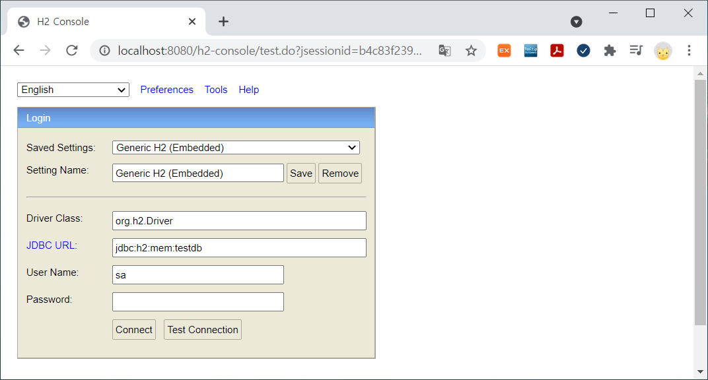
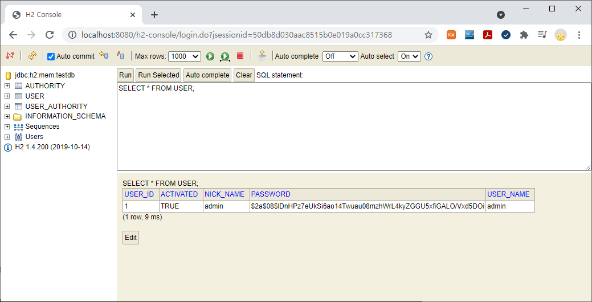
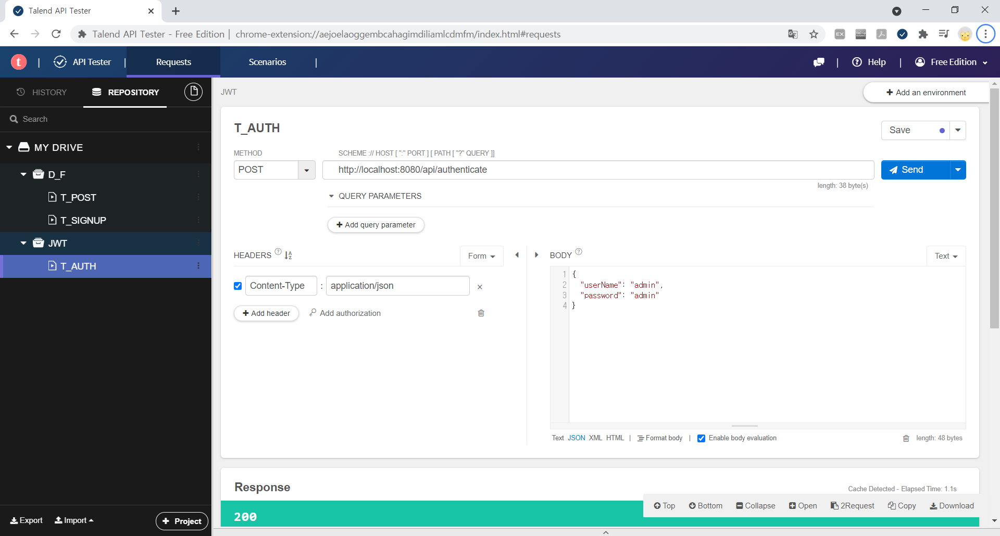
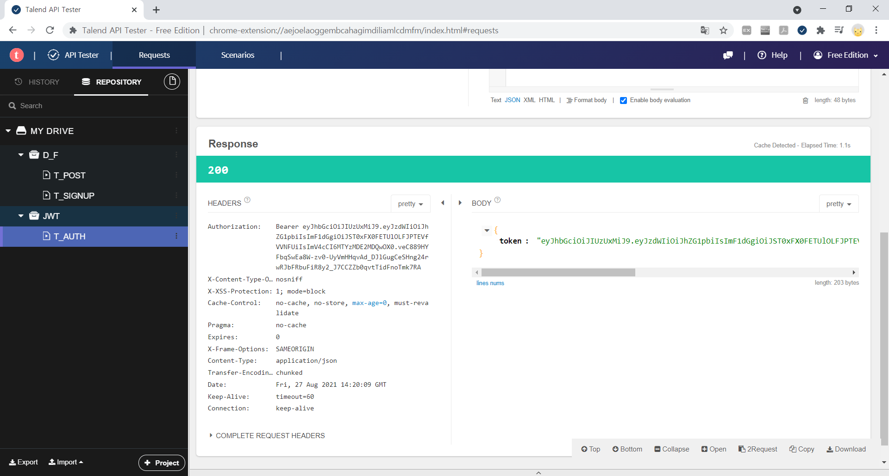
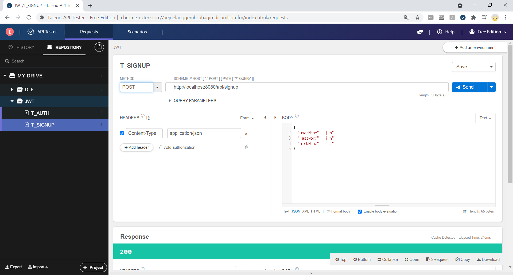
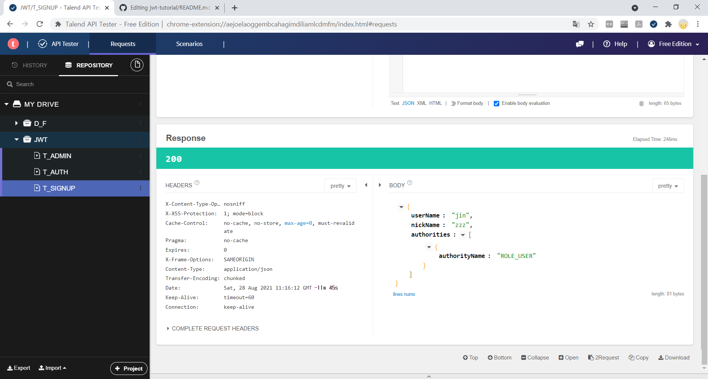
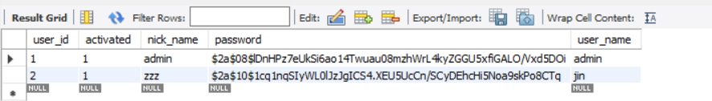

# jwt-tutorial

인프런 [Spring Boot JWT Tutorial] 강의를 듣고 실습한 내용 정리

#### 소개

- JWT는 RFC7519 웹 표준으로 지정되어 있는 JSON 객체를 사용하여 토큰 자체에 정보들을 저장하고 있는 Web Token 
- 간편하고 쉽게 적용할 수 있어 사이드 프로젝트를 진행할 때 주로 유용하게 쓰이며, 유의사항을 잘 고려하여 설계하면 대규모 프로젝트에서도 충분히 사용 가능한 인증 방식

 

JWT는 Header, Payload, Signature 3개의 부분으로 구성

- Header: Signature를 해싱하기 위한 알고리즘 정보
- Payload: 서버와 클라이언트가 주고받는, 시스템에서 실제로 사용될 정보
- Signature: 토큰의 유효성 검증을 위한 문자열. 이 문자열을 통해 서버에서는 이 토큰이 유효한 토큰인지 검증
 

**장점**

- 중앙의 인증서버, 데이터 스토어에 대한 의존성이 없음, 시스템 수평 확장 유리
- Base64 URL Safe Encoding > URL, Cookie, Header 모두 사용 가능

 

**단점**

- Payload의 정보가 많아지면 네트워크 사용량 증가, 데이터 설계 고려 필요
- 토큰이 클라이언트에 저장되므로 서버에서 클라이언트의 토큰을 조작할 수 없음

------

#### 1일차 (8/23)

1) Spring Initialize에서 프로젝트 생성
https://start.spring.io/

2) Security와  Data 설정

3) H2 Console 접속: http://localhost:8080/h2-console/ 

</img>

자동으로 쿼리문이 실행되어 데이터가 추가된 것을 확인

</img>

#### 2일차 (8/24)

1) JWT 설정 추가
2) JWT 관련 코드 개발
3) Security 설정 추가

#### 3일차 (8/25)

1) DTO
2) Repository
3) 로그인 API

* 토큰이 정상적으로 리턴된 것을 확인

</img>

</img>

#### 4일차 (8/26)

1) 회원가입 API
2) 권한검증 확인

* 회원가입 API에 대한 응답이 정상적으로 리턴되는 것을 확인

</img>

</img>

* 데이터베이스에 유저가 등록된 것을 확인

</img>

